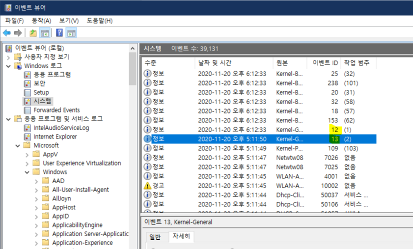
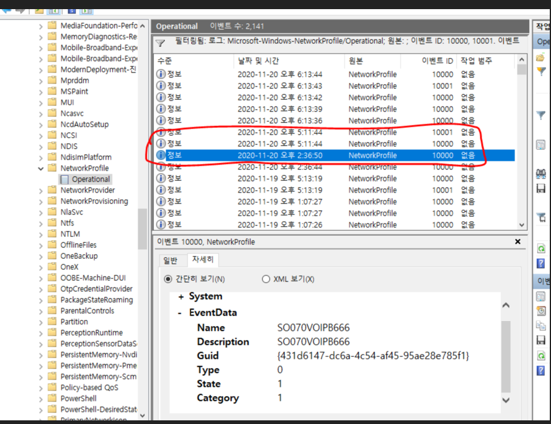
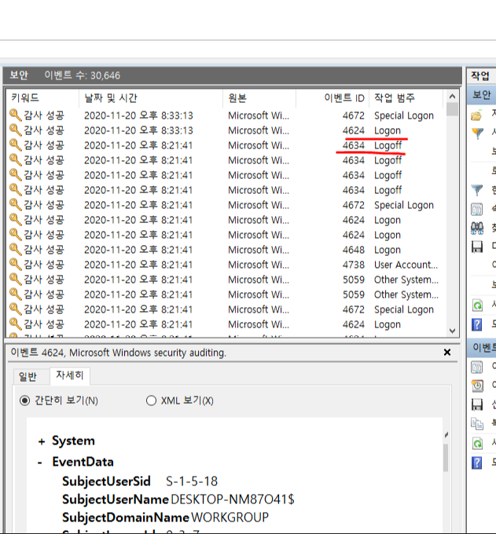
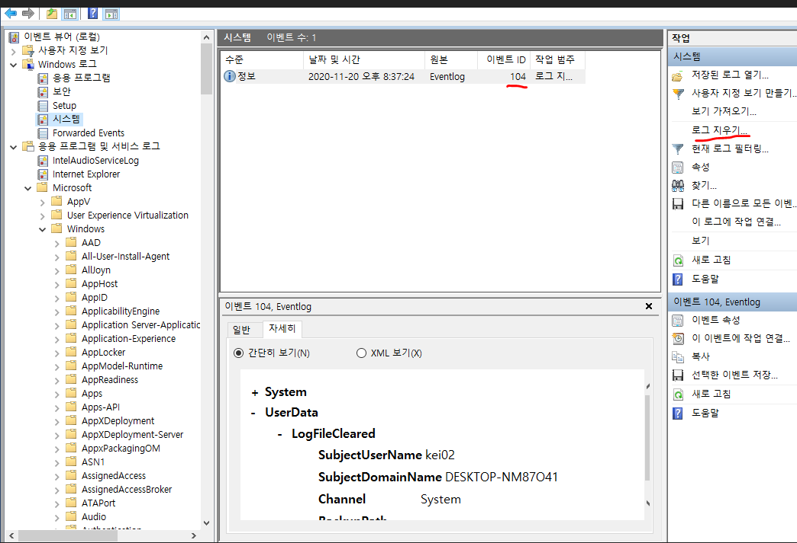
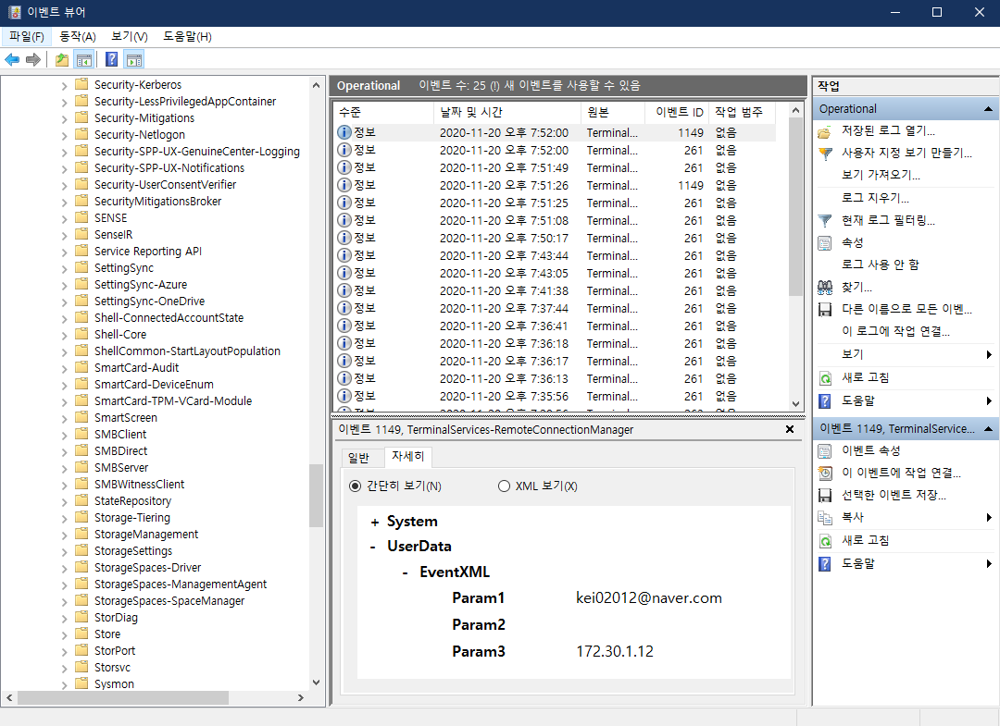

# 윈도우 이벤트 로그 분석
## PC 시작/종료
 
Windows 로그에 있는 시스템 이벤트 로그 ID 12번은 운영체제 시작을 의미하고  
사용자가 컴퓨터나 노트북 전원을 켠 시간으로 볼 수 있음  
Windows 로그에 있는 시스템 이벤트 로그 ID 13번은 운영체제 종료를 의미하고  
사용자가 컴퓨터나 노트북 전원을 켠 시간으로 볼 수 있음

## 네트워크 연결/해제

 
| event ID                        | 내용                                   |
| ------------------------------- | -------------------------------------- |
| NetworkProfile/Operational.evtx |
| 10000                           | 네트워크 연결-이름,설명,타입,상태,분류 |
| 10001                           | 네트워크 해제-이름,설명,타입,상태,분류 |

 네트워크 연결은 와이파이가 연결된 시간으로 볼 수 있음 
네트워크 해제는 와이파이가 연결되지 않은 시간으로 볼 수 있음 

## 로그온/로그오프
 
| event ID                        | 내용                                   |
| ------------------------------- | -------------------------------------- |
| Security.evtx |
| 4624                           | 로그온 |
| 4634                           | 로그오프 |
| 4648                           | 로그온 |

## 이벤트 로그 삭제
 
사진 속에서 오른쪽에 위치한 로그 지우기를 하면 시스템에 있는 이벤트 로그들이 전부 삭제됨.     
일반 사용자는 삭제하지 않기 때문에 안티 포렌식 행위로 의심. 
특정 행위와 관련된 로그파일이 삭제되었는지 확인할 필요 있음 

| event ID      | 내용                                                                      |
| ------------- | ------------------------------------------------------------------------- |
| System.evtx   |
| 104           | 시스템로그가 삭제됨 - 대상 파일의 이름을 기록                             |
| Security.evtx |
| 1102          | 로그가 삭제됨 - securty id 와 account 이름,도메인 이름, 로그온 id 등 기록 |

## 원격제어
근무 시간 외에 근무지 외부에서 PC를 이용할 경우가 있고 데이터 유출 경로가 될 수 있음 
Host PC와 Guest PC는 서로 다른 로그를 생성 
 

현재 사진은 Host 컴퓨터에서 감지한 로그들임
### Guest 컴퓨터가 Host 컴퓨터에 원격접속해서 제어하고 있는 상황.
 
Guest -> Host 

| event ID | 내용 |
| ----------------------------- | -------------------------------------------------------- |
|TerminalServices-RemoteConnectionManager/Operational.evtx(Connection)|
|261|RDP연결의 응답을 받음|
|1149|원격데스크톱 - 유저인증 성공.|
|41|원격 새션 시작!|
|TerminalServices-LocalSeesionManager/Operational.evtx(Disconnection)|
|24|RDP 세션이 연결이 끊킴|
|25|RDP 세션 재접속|
|42|세션 엔드|
  

Host -> Guest 

| EventID | 작업 | 내용 |
| --------------------------------------------- | ----------- |  ------------------------------------------------ |
|TerminalServics-RDPClient/Operaional.evtx(Connection)|
|1024|연결|RDP가 서버에 연결시도|
|1102|연결|클라이언트가 multi-transport 연결 시도?|
|1027|연결|도메인에 연결했다. - 도메인 이름이 나옴|
|Security.evtx(Disconnection)|
|4689|프로세스종료|mstsc.exe가 종료됬다. - RDP프로그램|
|TerminalServics-RDPClient/Operaional.evtx(Disconnection)|
|1105|연결해제|multi-transport 연결해제|
|1026|연결해제|RDP가 연결해제됨|
