# Winlogbeat (Windows 이벤트 로그)
[공식문서](https://www.elastic.co/guide/en/beats/winlogbeat/7.x/winlogbeat-installation-configuration.html)를 참조    

**새로운 이벤트가 적시에 전송되도록 이벤트 로그 감시하는 역할**  
winlogbeat는 window에 설치하여 log를 ES와 Logstash에 전송한다.  


## 1. Install Winlogbeat
   [링크](https://artifacts.elastic.co/downloads/beats/winlogbeat/winlogbeat-7.2.0-windows-x86_64.zip) 버튼을 눌러 winlogbeat 7.2 window ver 64bit 다운로드

     
c드라이브 안 Program Files 폴더 안에 Winlogbeat를 넣었다.   
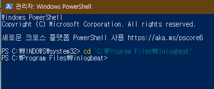  
관리자 권한으로 실행한 파워셀에 다운로드하고 압축을 푼 winlogbeat가 있는 경로를 먼저 입력한다.     
여기서 경로 시작과 끝에 작은 따옴표(')를 붙여줘야했다.    
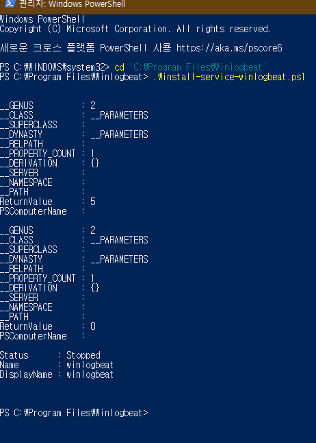       

**winlogbeat 설치**    

## 2. Connect to the Elastic Stack   
그 후 winlogbeat.yml 설정파일에 가서 설정을 변경 및 적용해야한다.   

yml 파일 문법을 참고하려면 이 
   [링크](https://www.elastic.co/guide/en/beats/libbeat/7.8/config-file-format.html)를 참조   

  
   
위의 화면은 logstash를 사용하도록 winlogbeat를 구성하는 yml파일이다.   
logstash를 사용하여 winlogbeat에 의해 수집된 데이터에 대해 추가처리를 수행하려면 yml파일을 수정해야한다.   
winlogbeat.yml파일을 수정하여 ElasticSearch output을 #로 주석처리하여 비활성화시키고   
logstash output의 주석처리를 해제하여 logstash 출력을 활성화시킨다.   
hosts 에는 내 아이피 주소 192.168.78.129를 입력했다.    
참고로 아이피주소는 우분투 터미널에서 ifconfig를 통해 알 수 있다.

## 3. Configure Winlogbeat 
원하는 로그 구성을 설정하고 logging할 옵션 설정 후 파워쉘에서 저장 및 test를 실행          
```PS C:\Program Files\Winlogbeat> .\winlogbeat.exe test config -c .\winlogbeat.yml -e```        
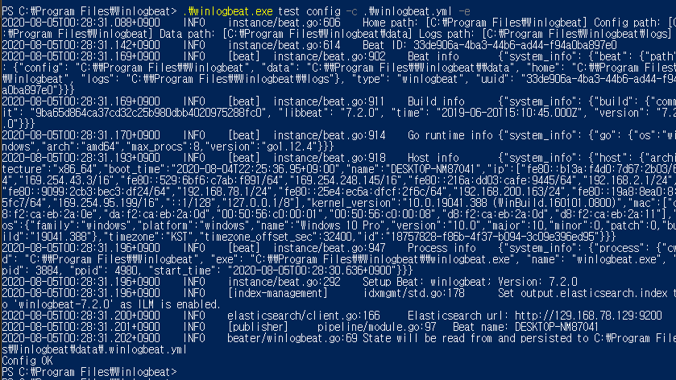 

## 4. Start Winlogbeat    
```PS C:\Program Files\Winlogbeat> Start-Service winlogbeat```    
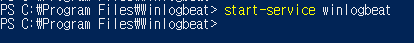           
해당 명령어는 winlogbeat 서비스를 시작하고   
winlogbeat가 실행 중이고 로깅 설정을 사용한 경우
C:\Program Files\Winlogbeat\Logs 위치에서 로그 파일을 볼 수 있다.<br>
```PS C:\Program Files\Winlogbeat> Get-Service winlogbeat```<br>
   
runngin 메세지가 화면에 표시되면 서비스가 실행 중인 것이다.    
지금 상태는 sysmon에 있는 데이터가 logstash로 실시간 전송 중이고    
elasticsearch에 실시간 저장 중이다.    
    
해당 명령어는 winlogbeat 서비스를 종료시킨다.

## powershell에서 지속적인 로그 모니터링
```.\winlogbeat.exe -c .\winlogbeat.yml -e```   
      
지속적인 로그 생성이 실시간으로 되는 것처럼 보인다.   


## Sysmon 설치 및 실행
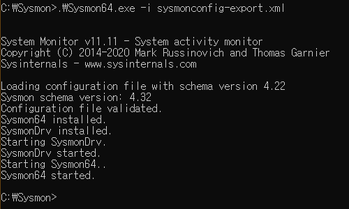    
```설치 및 실행 : Sysmon64.exe -i sysmonconfig-export.xml```    
Sysmon을 더 유용하게 사용하기 위해서 config 파일을 이용해야한다.        
편하게 이미 github에 공개된 sysmonconfig-export.xml파일을 이용한다.       
```수정 : Sysmon64.exe -c sysmonconfig-export.xml```    

### kibana를 통한 확인
   
kibana로 가서 index pattern을 보면 log가 올라오는 것을 알 수 있다.    
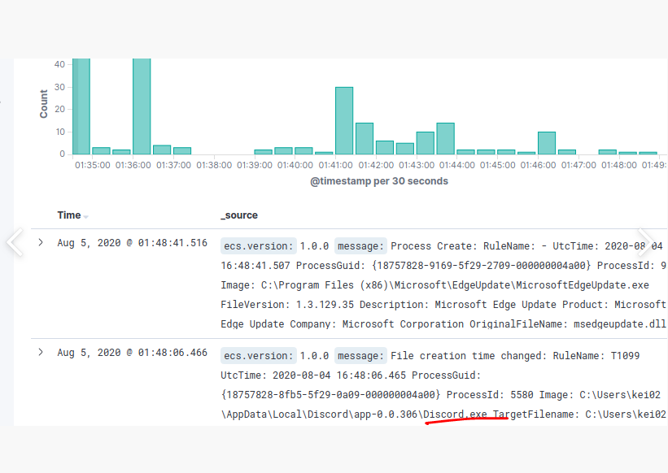     
이 시간대에 디스코드를 사용하고 있었는데 로그가 제대로 올라온 것처럼 보인다.    
로그가 출력된 것을 확인하여 필터링 과정으로 원하는 로그를 거르고    
시각화를 통해 앞으로의 프로젝트에 사용될 몰입도 설정이 가능할 것으로 예상된다.        
시간대는 우분투 시간과 일치한다.   


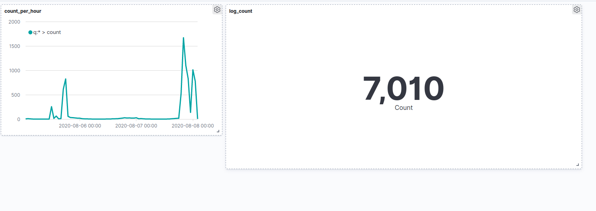   
최종 dashboard 만든 것.   
timelion을 통해 로그들을 보면 얼추 내가 컴퓨터를 이용했던 시간에 로그들이      
더 많이 생성되고 컴퓨터가 꺼져있을 때는 0에 가까운 것을 알 수 있다.   
궁금한 것이 몇가지 있는데 실제로 사용하지 않을 때도 로그가 생성되고 있고    
시간이 정확히 일치하는지는 장담을 못하겠다.   
개념상 실시간으로 연동된다고 하지만 계속 update나 새로고침을 눌러서   
로그들을 확인해야되는 경우도 있었고 실제로 30초 차이가 난 경우도 있었다.   
이런 부분들에 대해선 팀원들과 의논을 더 해봐야겠다.

--------------------------------------------------------------------------
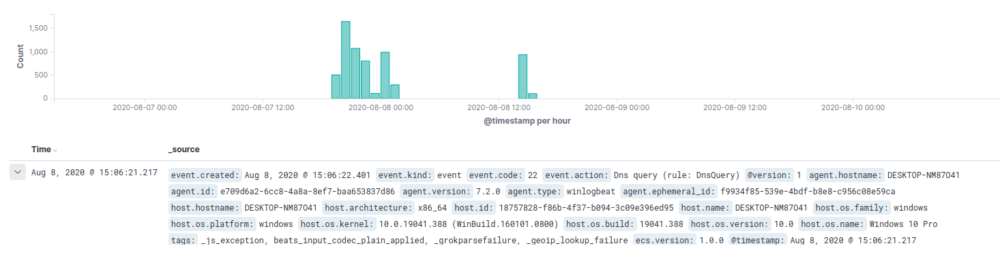

## ECS Field Reference

field에 따른 각각의 의미를 먼저 알아보고 프로젝트에 어떤 유의점을 가지고 
해당 항목들을 필터링 할지 고민하며 해당 표를 참조. 

https://www.elastic.co/guide/en/ecs/current/ecs-field-reference.html#ecs-fieldsets 참고!

| 필드 | 의미 |비고 |
|---|:---:|---:|
| `Base` | 최상위 수준에서 직접 정의 된 모든 필드 | |
| `Agent` | 모니터링 에이전트에 대한 필드 |  |
| `Autonomous System` | 자율시스템(인터넷 라우팅 접두사)을 설명하는 필드 |  |
| `Client` | 서버와 함꼐 사용되는 네트워크 연결의 클라이언트 측에 대한 필드 |  |
| `Cloud` | 클라우드 리소스에 대한 필드 |  |
| `Code Signature` | 2진 코드서명에 대한 정보 |  |
| `Container` | 해당 이벤트르르 생성한 컨테이너에 대한 설명 |  |
| `Destination` | 소스와 함꼐 사용되는 네트워크 연결의 대상측에 대한 필드 |  |
| `DLL` | 동적으로된 코드 라이브러리에 대한 정보가 포함|  |
| `DNS` | DNS 쿼리 및 답변을 설명하는 필드 |  |
| `ECS` | ECS에 특정한 메타 정보 |  |
| `Error` | 모든종류에 대한 필드 |  |
| `Event` | 이벤트 세부정보를 분류하는 필드 |  |
| `File` | 파일을 설명하는 필드 |  |
| `Geo` | 위치를 설명하는 필드  |  |
| `Gruop` | 이벤트와 관련된 사용자 그룹 |  |
| `Hash` | 해시 (일반적으로 파일 해시 ) | Hash에 대한 홈페이지 : https://wnw1005.tistory.com/261 |
| `Interrface` | Observer의 인터페이스 정보를 설명하는 필드 |  |
| `Log` | 이벤트의 로깅 메커니즘에 대한 세부 정보 |  |
| `Network` | 이벤트가 발생한 통신 경로를 설명하는 필드|  |
| `Observer` | 호스트 외부에서 이벤트를 관찰하는 엔티티를 설명하는 필드 |  |
| `Organization` | 이벤트와 관련된 조직 또는 회사를 설명하는 필드 |  |
| `Operating system` | 운영체제에 대한 정보 |  |
| `Package` | 소프트웨어 패키지에 대한 정보 |  |
| `PE` | Window PE 메타 데이터 포함 | Window PE : 윈도우 사전 설치 환경 , 윈도우 설치시에 뜨는 화면 -> 가장 기본적인 기능의 window의 기능 포함<br> 관련 홈페이지 : https://wjdqh6544.tistory.com/163
| `Process` | 프로세스에 대한 정보 |  |
| `Registry` | Windows 레지스트리 작업과관련된 필드 |  |
| `Related` | 데이터를 중심으로 피벗을 용이하게 하기위한 필드 |  |
| `Rule` | 경고 또는 기타 주목할만한 이벤트를 생성하는데 사용되는 규칙에 대한 세부정보를 캡처하는 필드 |  |
| `Server` | 네트워크 연결의 서버측에 대한 필드 |  |
| `Service` | 데이터가 수집된 서비시를 설명하는 필드 |  |
| `Source` | 대상과 함꼐 사용되는 네트워크 연결의 소스 측에 대한 필드  |  |
| `Threat` | 위협분류에 따라 이벤트 및 경고를 분류하는 필드 |  |
| `TLS` | TLS 연결을 설명하는 필드 | TLS : 인터넷에서의 정보를 암호화해서 송수신하는 프로토콜 , TLS를 이용한 암호화된 연결을 하는 HTTP -> HTTPS , 기본포트는 80 이지만 HTTPS는 443 <br> 관련 홈페이지 https://namu.wiki/w/TLS |
| `Tracing` |  트레이싱(분산추적)과 관련된 필드|  |
| `URL` | 다앙한 형식으로 URL을 지정할 수 있는 필드 |  |
| `User` | 이벤트과 관련된 사용자를 설명하는 필드 |  |
| `User agent` | 브라우저 user_agent 문자열을 설명하는 필드 |  |
| `VLAN` | 관찰된 VLAN 정보를 설명하는 필드  | VLAN : 가상 근거리 통신망 , 일반적으로 스위치나 라우너 장비에서 수행된다. |
| `Vulnerabilty` | 이벤트와 관련된 취약성을 설명하는 필드 |  |


## Log 분석
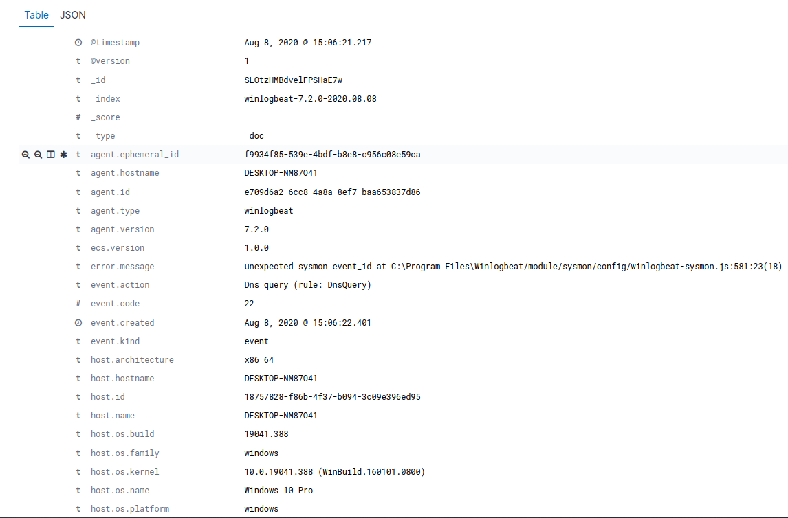  

**1. Agent field**

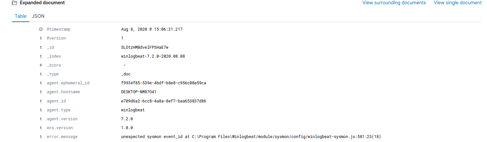 

https://www.elastic.co/guide/en/ecs/current/ecs-agent.html

| 필드 | 내용 |분석 |
|---|:---:|---:|
| `agent.ephemeral_id` | f9934f85-539e-4bdf-b8e8-c956c08e59ca | 해당 agent의 임시 식별자 , 재시작 시 변경|
| `agent.hostname` | DESKTOP-NM87041 |노트북 시스템 번호 |
| `agent.id` | e709d6a2-6cc8-4a8a-8ef7-baa653837d86(위의 내용과 같은 자리수의 다른 ID) | 에이전트의 고유 식별자 |
| `agent.type` | winlogbeat | 해당 로그의 agent는 winlogbeat이고 해당 agent의 고유 ID는 agend.id에서 확인할 수 있다. |
| `agent.version` | 7.2.0 | 해당 agent의 version은 7.2.0 이다.|


**2. event field**

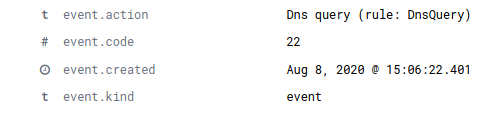 

https://www.elastic.co/guide/en/ecs/current/ecs-event.html

| 필드 | 내용 |분석 |
|---|:---:|---:|
| `event.action` |	DNS query <br>(rule: DNSQuery)| |
| `event.code` | 22 | 이 이벤트에 대한 식별코드가 있는경우이므로 이벤트 코드 22을 사용하여 message를 명확하게 구분<br> 22 : DNSEvent(DNS query) <br> 22번 이벤트는 프로세스가 DNS 쿼리를 실행할 때 결과가 성공했는지,실패했는지, 캐시에 저장되었는지 여부를 나타낸다.   |
| `event.created` |Aug 8, 2020 @ 15:06:22.401| 해당 시간에 이벤트가 발생된 것으로 보인다. |
| `event.kind` |event| 이벤트 종류는 event이다.  이벤트는 event, metric, state, pipeline_error, signal 중 하나여야 하므로 정상 event이다. |
| `event.provider` |Microsoft-Windows-Sysmon| 이벤트 제공자는 Microsoft-Windows-Sysmon 이다. |

**3. host & log**

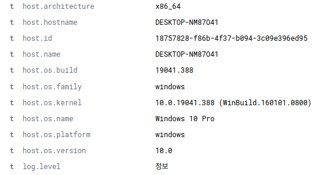 

https://www.elastic.co/guide/en/ecs/current/ecs-host.html<br>
https://www.elastic.co/guide/en/ecs/current/ecs-log.html

**4. message**

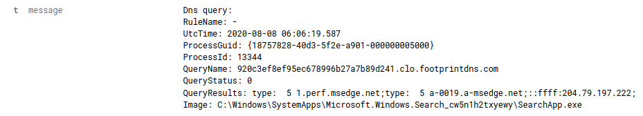

위의 event code에서 확인 했듯이 해당 event.code 가 22
해당 진행이 실제로 진행된 시간은 2020-08-08 06:06:19.587 였다.

**4. winlog**

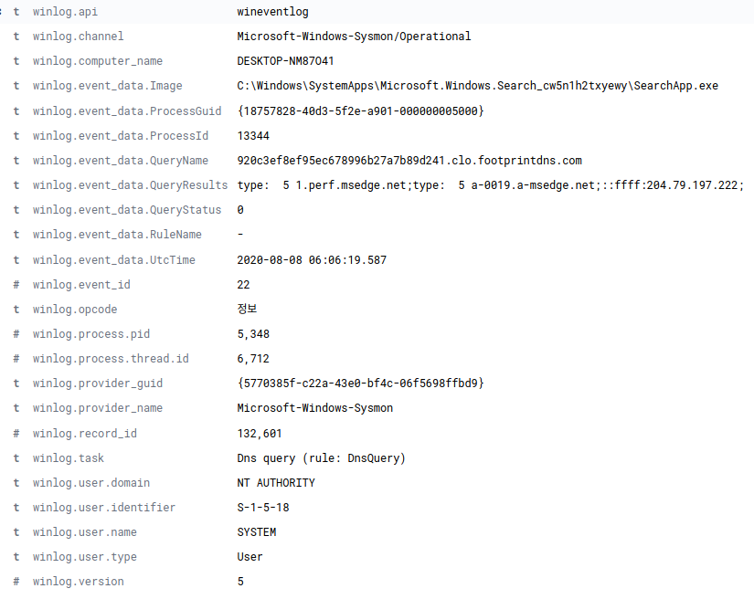

https://www.elastic.co/guide/en/beats/winlogbeat/master/exported-fields-winlog.html 

| 필드 | 내용 |분석 |
|---|:---:|---:|
| `winlog.api` |  wineventlog	| 기록을 읽는데 사용되는 로그 API유형은 wineventlog이다. |
| `winlog.channel` |	Microsoft-Windows-Sysmon/Operational| 이 기록을 읽은 채널의 이름이다.  |
| `winlog.task` |DNS query (rule: DNS Query)	|이벤트에 정의된 작업이 레지스트리의 값을 설정한 것이고 이는 이벤트가 기록된 응용프로그램의 위치를 식별하는 게 사용한다.  |
| `winlog.user.domain` |NT AUTHORITY	| 해당 이벤트의 구성과 관련된 도메인이 NT AUTHORITY이고 이는 표준권한 서비스를 실행하기 위한 제한된 서비스 계정으로 네트워크를 사용하기 위한 익명의 윈도우 서비스계정이다.  |
| `winlog.user.identifier` |S-1-5-18	| 해당 이벤트에 관련된 계정의 보안 식별자이다. |
| `winlog.user.name` |SYSTEM	| 주로 user.doamin과 관련이 있으며 NT AUTHORITY\SYSTEM 이다.  |
| `winlog.user.type` |	Well known Group| 이는 S-1-5-18은 잘 알려진 보안식별자에 속에 있으며 이름은 로컬 시스템이여 운영체제에서 사용하느 서비스 계정 |
| `winlog.version` |5	| 이벤트 정의의 버전 번호가 5번인것으로 보아 수정이 4회 이뤄 졌다. |