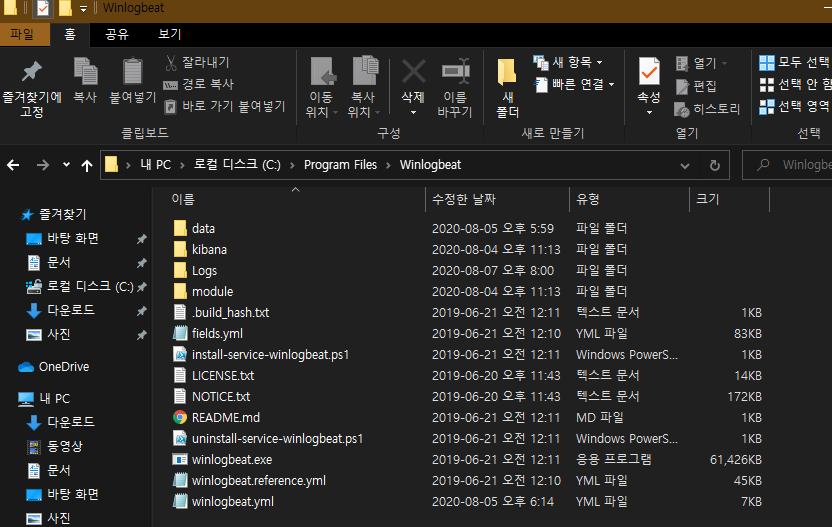
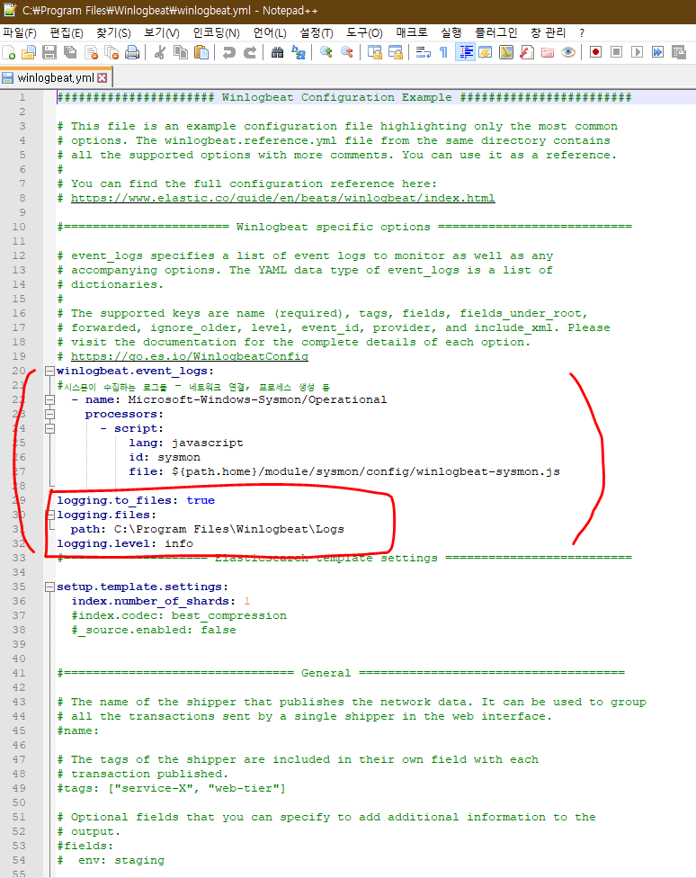
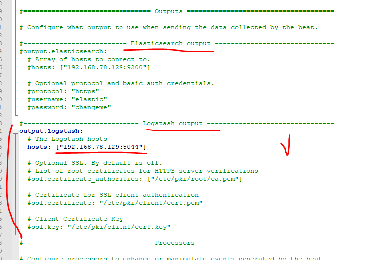
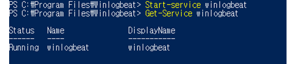
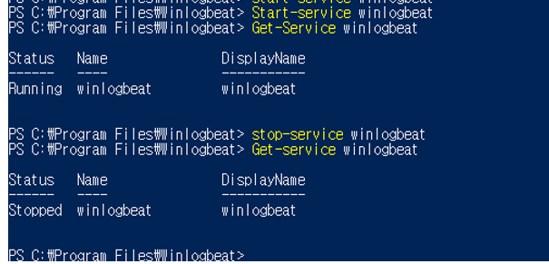
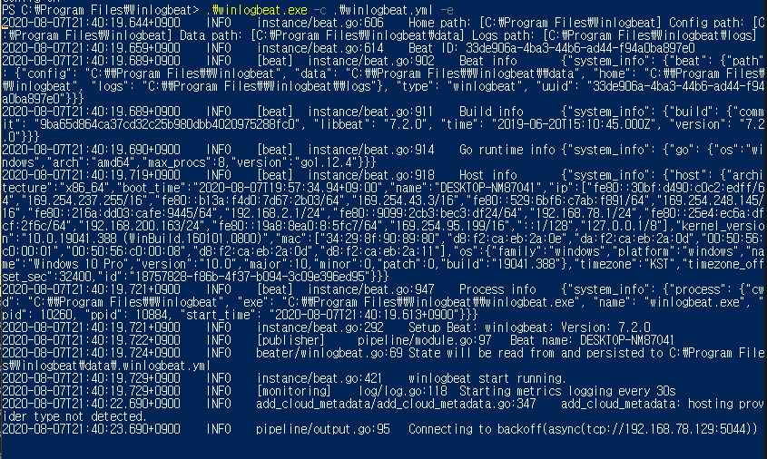
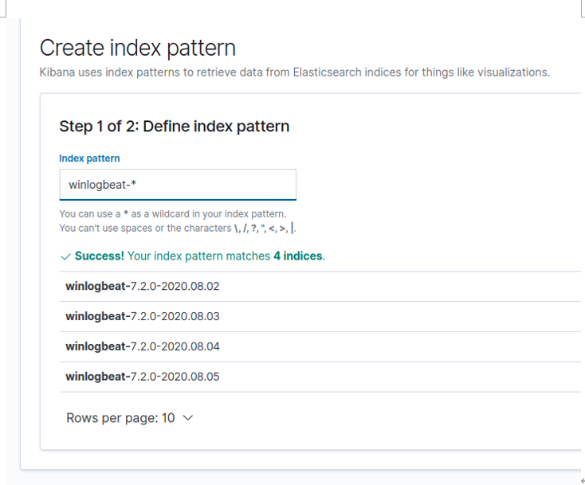

# Winlogbeat (Windows 이벤트 로그)
[공식문서](https://www.elastic.co/guide/en/beats/winlogbeat/7.x/winlogbeat-installation-configuration.html)를 참조    

**새로운 이벤트가 적시에 전송되도록 이벤트 로그 감시하는 역할**  
winlogbeat는 window에 설치하여 log를 ES와 Logstash에 전송한다.  


## 1. Install Winlogbeat
   [링크](https://artifacts.elastic.co/downloads/beats/winlogbeat/winlogbeat-7.2.0-windows-x86_64.zip) 버튼을 눌러 winlogbeat 7.2 window ver 64bit 다운로드

     
c드라이브 안 Program Files 폴더 안에 Winlogbeat를 넣었다.   
   
관리자 권한으로 실행한 파워셀에 다운로드하고 압축을 푼 winlogbeat가 있는 경로를 먼저 입력한다.     
여기서 경로 시작과 끝에 작은 따옴표(')를 붙여줘야했다.      

**winlogbeat 설치**    

## 2. Connect to the Elastic Stack   
그 후 winlogbeat.yml 설정파일에 가서 설정을 변경 및 적용해야한다.   

yml 파일 문법을 참고하려면 이 
   [링크](https://www.elastic.co/guide/en/beats/libbeat/7.8/config-file-format.html)를 참조   

  
   
위의 화면은 logstash를 사용하도록 winlogbeat를 구성하는 yml파일이다.   
logstash를 사용하여 winlogbeat에 의해 수집된 데이터에 대해 추가처리를 수행하려면 yml파일을 수정해야한다.   
winlogbeat.yml파일을 수정하여 ElasticSearch output을 #로 주석처리하여 비활성화시키고   
logstash output의 주석처리를 해제하여 logstash 출력을 활성화시킨다.   
hosts 에는 내 아이피 주소 192.168.78.129를 입력했다.    
참고로 아이피주소는 우분투 터미널에서 ifconfig를 통해 알 수 있다.

## 3. Configure Winlogbeat 
원하는 로그 구성을 설정하고 logging할 옵션 설정 후 파워쉘에서 저장 및 test를 실행          
```PS C:\Program Files\Winlogbeat> .\winlogbeat.exe test config -c .\winlogbeat.yml -e```        
 

## 4. Start Winlogbeat    
```PS C:\Program Files\Winlogbeat> Start-Service winlogbeat```    
           
해당 명령어는 winlogbeat 서비스를 시작하고   
winlogbeat가 실행 중이고 로깅 설정을 사용한 경우
C:\Program Files\Winlogbeat\Logs 위치에서 로그 파일을 볼 수 있다.<br>
```PS C:\Program Files\Winlogbeat> Get-Service winlogbeat```<br>
   
runngin 메세지가 화면에 표시되면 서비스가 실행 중인 것이다.    
지금 상태는 sysmon에 있는 데이터가 logstash로 실시간 전송 중이고    
elasticsearch에 실시간 저장 중이다.    
    
해당 명령어는 winlogbeat 서비스를 종료시킨다.

## powershell에서 지속적인 로그 모니터링
```.\winlogbeat.exe -c .\winlogbeat.yml -e```   
      
지속적인 로그 생성이 실시간으로 되는 것처럼 보인다.   


## Sysmon 설치 및 실행
    
```설치 및 실행 : Sysmon64.exe -i sysmonconfig-export.xml```    
Sysmon을 더 유용하게 사용하기 위해서 config 파일을 이용해야한다.        
편하게 이미 github에 공개된 sysmonconfig-export.xml파일을 이용한다.       
```수정 : Sysmon64.exe -c sysmonconfig-export.xml```    

### kibana를 통한 확인
   
kibana로 가서 index pattern을 보면 log가 올라오는 것을 알 수 있다.    
     
이 시간대에 디스코드를 사용하고 있었는데 로그가 제대로 올라온 것처럼 보인다.    
로그가 출력된 것을 확인하여 필터링 과정으로 원하는 로그를 거르고    
시각화를 통해 앞으로의 프로젝트에 사용될 몰입도 설정이 가능할 것으로 예상된다.        
시간대는 우분투 시간과 일치한다.   
djfkd