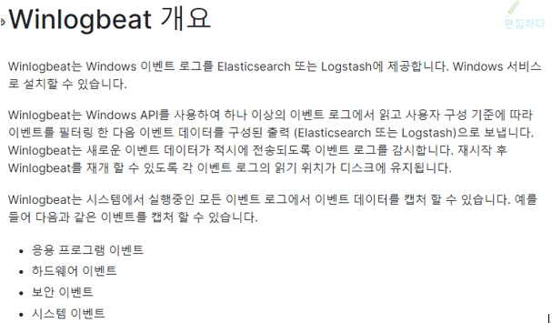

# Winlogbeat 개요
** 새로운 이벤트가 적시에 전송되도록 이벤트 로그 감시하는 역할**    

## 시작하기 전에

> 사전 설치 제품 
> Kibana, Elasticsearch, Logstash(선택사항)

## 설치법 - 공식 문서 자료 참고해서 실습

1. [링크](https://artifacts.elastic.co/downloads/beats/winlogbeat/winlogbeat-7.2.0-windows-x86_64.zip) 버튼을 눌러 winlogbeat window ver 64bit 다운로드!

