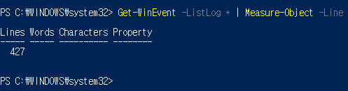
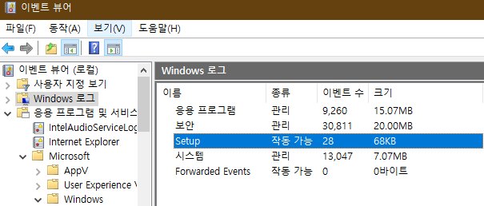
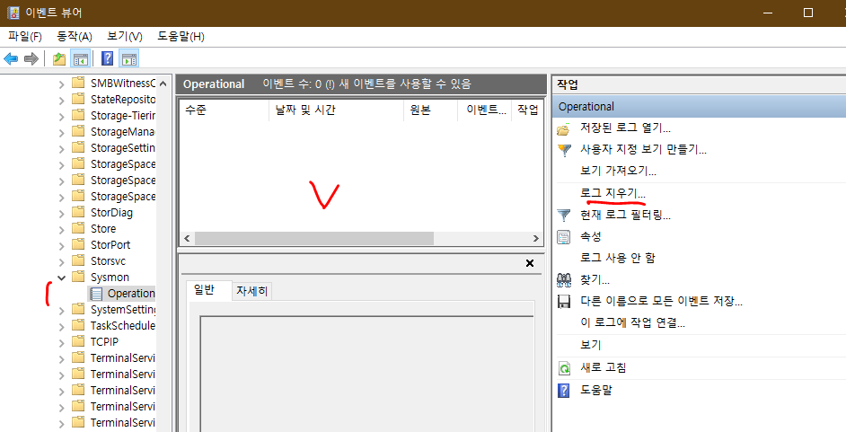
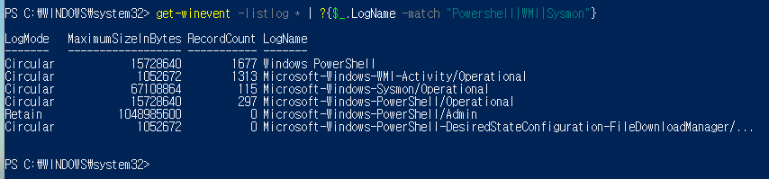
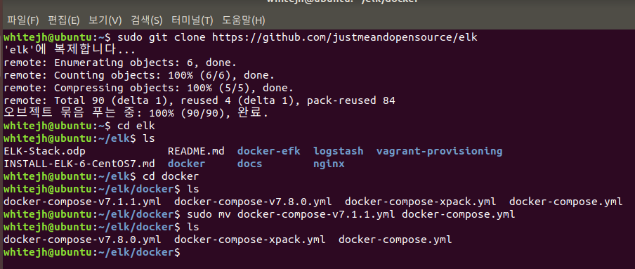
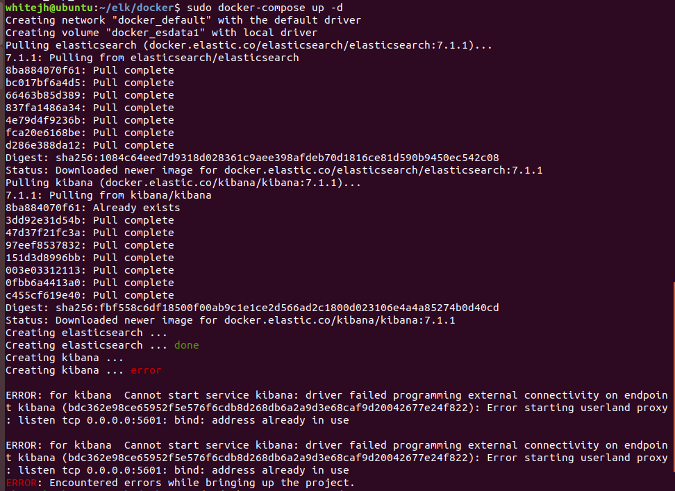
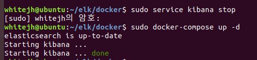
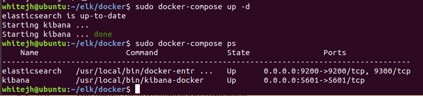

## 이벤트 뷰어
```
Get-WinEvent -ListLog * | Measure-Object -Line
```   
      
해당 명령어를 사용하면 총 로그 항목을 확인할 수 있다.
총 427개의 로그 항목 존재.
yml 파일에 설정해주면 자동으로 데이터가 넘어가 필터링이 됨.

## 쌓인 로그 지우기


로그 지우기 누르면 전체 다 지워짐   





# Configure Winlogbeat to monitor Windows logs & events
   [유투브 링크](https://www.elastic.co/guide/en/beats/libbeat/7.8/config-file-format.html)를 보고 실습    

 

```
sudo apt install git
sudo git clone https://github.com/justmeandopensource/elk
cd elk/docker/
sudo mv docker-compose-v7.1.1.yml docker-compose.yml 
```
로 docker-compose.yml 하나만 docker에 yml 파일로 저장되어 있는 상황

  [docker 설치 링크](https://blog.cosmosfarm.com/archives/248/%EC%9A%B0%EB%B6%84%ED%88%AC-18-04-%EB%8F%84%EC%BB%A4-docker-%EC%84%A4%EC%B9%98-%EB%B0%A9%EB%B2%95/)


  [docker-compose 설치 링크](https://soyoung-new-challenge.tistory.com/73)

```
sudo systemctl start docker
sudo systemctl status docker
sudo docker-compose up -d
sudo docker-compose ps
```

    
kibana에서 에러 발생


     
sudo service kibana stop으로 kibana를 잠깐 멈추고   
다시 도커 컴포즈 했더니 잘됨....
여기서 의문점   
- 엘라스틱서치도 켜놓고 키바나도 켜놓은 상태에서 도커 컴포즈를 했는데
  키바나에서만 오류가 발생했고 키바나를 끄고 다시 도커 컴포즈를 했더니 잘됨....

  




[유섭 깃허브 참고](https://github.com/useop96/ELK-study/blob/master/WinlogbeatStudy-1.md)!!
