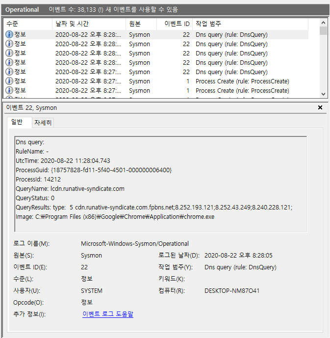
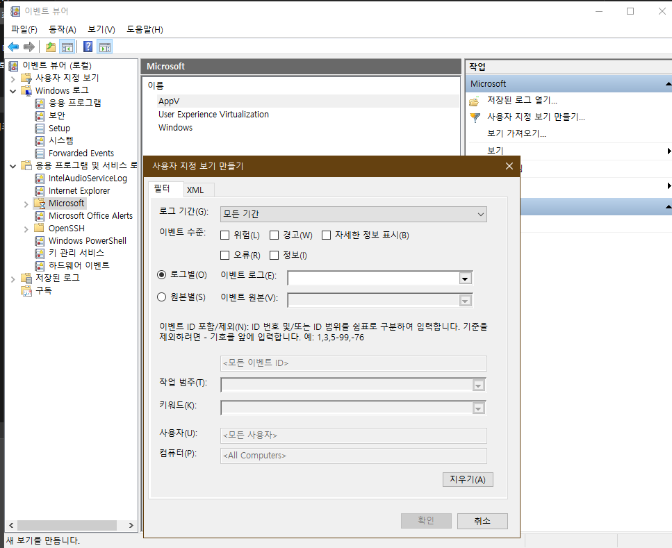
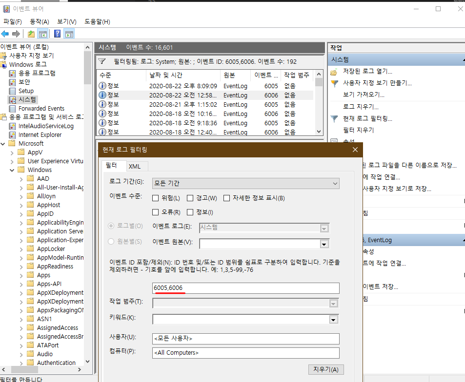
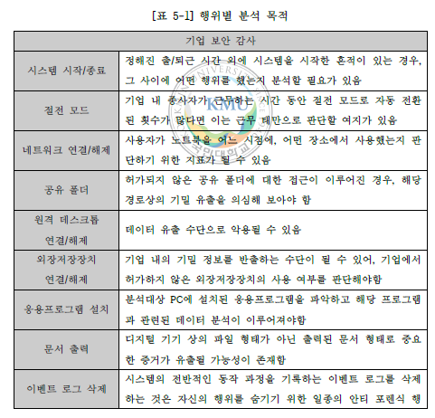

# 윈도우 이벤트 로그(EVTX) 분석 및 포렌식 활용방안 논문 분석 및 고찰

윈도우 이벤트 로그는 Windows 운영체제의 시스템 로그 관리 기법으로, 

Windows Vista부터 시스템의 전반적인 동작 과정을 EVTX 파일로 관리한다. 

해당 파일에는 PC 사용자 및 악성코드의 동작을 탐지할 수 있는 데이터가 저장되어 있으나, 

데이터 선별 기술의 미비로 포렌식 수사에서의 활용도가 낮다. 

이에 본 연구에서는 기업 내의 기밀 유출 및 근무 태만과 관련된 10가지 행위

(시스템 시작/종료, 절전 모드, 네트워크 연결/해제, 공유 폴더, 원격 데스크톱 연결/해제, 외장저장장치 연결/해제, 응용 프로그램 설치, 문서 출력, 이벤트 로그 삭제, 시스템 시간 변경)와 

악성코드 관련 5가지 행위(파일 조작, 레지스트리 조작, DNS 질의, 프로세스 생성/종료, 윈도우 서비스 추가)를 선정하였다. 

각 행위와 관련된 EVTX 파일과 이벤트 ID를 설명하고, 이벤트 메시지 분석 방법을 제시하였으며, 이를 기반으로 행위 기반 EVTX 포렌식 분석도구를 개발하였다.

## 이벤트 로그

windows 운영체제의 시스템 로그 저장 방식   
시스템이 동작하면서 발생하는 이벤트를 로그 형태로 관리    
xml기반의 EVTX 형식을 사용    
이벤트 로그 분석을 통해 기업 감사 및 침해사고 대응과 관련된 유용한 데이터 획득 가능     

그러나 현재 실시간으로 생성되는 방대한 양의 로그 중에서 사용자 또는 시스템 자체의   
특정 행위와 관련된 로그를 선별 및 분석하기 위한 기술이 미비한 상황.

이벤트 로그는 사용자의 의도와 관계없이 저장되는 생성증거에 해당.    
이러한 특성을 보고 업무 몰입도 분석에 유용하게 사용될 것 같다.    

## 윈도우 이벤트 로그(EVTX)

윈도우 이벤트 로그는 시스템, 애플리케이션 작동 상태 및 사용자의 행위에 따라   
발생하는 모든 동작에 대한 기록을 남기는 기능으로,     
관련 로그를 참고하여 시스템 상의 오류를 파악할 수 있다.  

## EVTX 구성요소
### 이벤트 뷰어


- 로그 이름 : 이벤트 로그 파일 이름          
- 원본 : 서비스 공급자 이름     
- 이벤트 ID : 이벤트 식별자      
- 수준 : 발생한 이벤트의 심각성 정도    
  (위험, 오류, 경고, 정보, 자세한 정보 표시)    

- 사용자 : System 또는 Customer    
- Opcode : 구성요소가 수행하는 작업 범주 식별     
- 로그된 날짜(TimeCreated) : 로그가 기록된 날짜    
- 작업 범주 : 원본에 의한 이벤트 분류   
- 키워드 : 이벤트 분류    
- 컴퓨터 : 로그가 기록된 PC 이름    
  
## GUI (Graphic User Interface) 기반 EVTX 분석도구



이벤트뷰어는 해당 프로그램이 실행된 PC의 EVTX 파일을 분석    
위의 그림은 이벤트 뷰어의 메인화면.    
실행 시 기본 경로에 저장된 로그를 불러와 분석을 진행.    
'Windows 로그'와 '응용 프로그램 및 서비스 로그'로 구분하여   
로그파일의 종류를 트리 형태로 표시.    
사용자는 많은 로그 중에서 원하는 기간, 이벤트 수준, 로그 파일, 원본, 작업 범주, 키워드 및 이벤트 ID에 대하여   
필터링을 적용할 수 있고, 그 결과를 '사용자 지정 보기'에서 확인가능.    

이벤트 뷰어는 PC 관리자가 시스템 상의 문제점과  이후에 발생할 수 있는 위험요솔를 파악할 때,    
유용하게 사용될 수 있으나 몇가지 한계점이 존재....      

1. 다른 PC에서 추출한 여러 개의 EVTX 파일 분석이 불가능    
   프로젝트 면에서 보면 원격 업무에서 관리자가 여러 업무자로부터 추출한 EVTX 폴더를 입력하였을 때,    
   분석결과를 확인할 수 있는 도구 개발 필요.

2. 사용자의 행위를 탐지하기 어려움    
   하나의 행위가 발생하였을 때, 여러 시스템 요소에 의해 로그가 기록될 수 있다.   
   이것은 여러 EVTX 파일에 기록된 로그를 통합적으로 분석해야 함을 의미.    
   이벤트 뷰어가 필터링 기능을 지원하기 때문에 확인하고자 하는 행위에 대한   
   이벤트 ID를 선택적으로 출력할 수 있다.   
   그러나 실시간으로 많은 업무자들의 PC를 빠르게 분석해야하는 경우,    
   매번 필터링을 적용하고 모든 로그를 확인하는 것이 어렵다.    

   결국 지금 고민하고 있는 업무 몰입도 측정 기준을 선별하고,    
   각 행위에 대한 로그를 자동으로 필터링할 수 있는 전용 분석도구 개발 필요.

## 이벤트 뷰어를 통해 윈도우 부팅시간 확인하기

https://prolite.tistory.com/1052 참고



윈도우는 컴퓨터를 부팅하거나 종료할 때 혹은 업데이트 시    
시스템 관련 정보를 기록할 때 이벤트 뷰어로 로그를 남긴다.    
시스템에 언제 무슨 일이 로그를 통해 있었는지 알 수도 있다.    

나도 모르게 재부팅되거나 언제 꺼졌는지 간단하게 이벤트 뷰어를 통해 참고하여    
시스템에 문제가 생겼는지 점검 가능

### 이벤트 ID
```
6005 : 이벤트 로그 서비스 시작, 부팅 시 기록
6006 : 정상적인 시스템 종료 시 기록
6008 : 비정상적인 시스템 종료 시 기록
```

