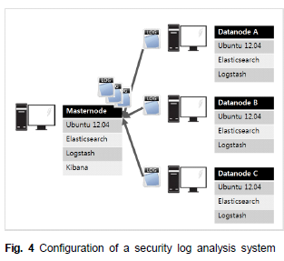
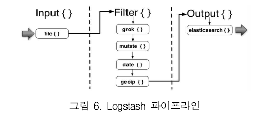

# 아파치 엘라스틱서치 기반 로그스태시를 이용한 보안로그 분석시스템

## 요약 및 결과    
Elasticsearch 기반의 로그 분석시스템을 사용할 경우 하둡 기반의 로그 분석시스템에 비하여     
데이터베이스 쿼리 처리시간 및 로그 데이터 분석 시간을 현저하게 줄일 수 있음을 보임. 성능 개선

### 로그
사용자의 행동패턴 및 이벤트 등을 저장하는 대상

보안사고 혹은 시스템 장애 발생 시 중요한 증거장료로 사용될 뿐만 아니라, 외부위협, 이상행위 등을 탐지하기 위한 용도로 사용됨

### 로그스태시
다양한 종류의 로그데이터를 입출력 및 가공 처리할 수 있는 엘라스틱서치의 수많은 플러그인 중 하나

오픈소스 서버측 데이터 처리 파이프라인으로서 다양한 소스에서 동시에 데이터를 수집하여 변환한 후 자주 사용하는 저장소 즉, 엘라스틱 서치로 보냄    
데이터가 소스에서 저장소로 이동함에 따라 로그스태시 filter는 각 이벤트의 구문을 분석하고     
명명된 필드를 식별하여 구조를 구성, 공통 형식으로 변환 통합하여 분석을 쉽게 하고 시간을 단축시킴

## 엘라스틱서치를 이용한 보안로그 분석시스템 구현

### 엘라스틱서치를 이용한 보안로그 분석시스템 설계 

 
**엘라스틱서치를 이용한 보안로그 분석시스템의 전체구성도**    

에이전트와 보안 디바이스에서 발생하는 보안 로그 데이터를 로그스태시 컬렉터를 이용하여    
수집 후 로그스태시 인덱서와 엘라스틱서치 싱크를 이용해 엘라스티서치에 저장하여 키바나를 이용하여   
시각화 및 사용자 모니터링을 할 수 있도록 구성    

먼저, 로그스태시 Collector는 에이전트 부분에 존재하는 방화벽, 웹서버 등의 보안 장비에서 나오는 로그데이터를 수집    

그 다음 로그스태시 Indexer에서 로그스태시 컬렉터로부터 로그 데이터를 수집한 후에 엘라스틱서치에 데이터를 저장    

이렇게 하면 분산검색엔진인 엘라스티서치를 이용해 로그 데이터를 인덱싱하여 필요한 때에 실시간으로 데이터를 분석하고 검증 가능

마지막으로 키바나를 이용하여 시각적으로 로그 통계 및 검색 리포트를 생성하고 그 결과를 시각화   

### 엘라스틱서치를 이용한 보안로그 분석시스템 환경 구축

 
**엘라스틱서치를 이용한 보안로그 시스템 환경을 구축하는데 사용한 총 4대의 서버**

네임노드 1대와 3대의 데이터 노드로 구성하였으며, 네임노드의 운영체제는 Ubuntu 기반

로그 데이터가 발생하면 로그스태시 Collector에서 로그 데이터를 전송하고, 

엘라스틱서치를 이용하여 저장한 후 키바나를 이용하여 모니터링 가능하도록 구현

엘라스틱서치를 설치하여 실행하면 하나의 노드가 마스터 노드로 선정됨

마스터 노드가 멈추게 되면 또 다른 노드가 새로운 마스터 노드가 됨

각 노드는 여러 개의 Shard로 데이터를 분산 저장하며, Shard는 복사본을 가짐

노드가 정지하게 될 경우 정지된 노드의 데이터를 다른 노드에 복사한 후에 자동으로 정렬됨

# 네트워크 보안 관제를 위한 로그 시각화 방법
## 요약 및 결과
정보시스템에서 정보 보안의 중요성이 강조됨에 따라 이에 대응하기 위해 많은 기업이 보안 솔루션 도입

보안 솔루션을 관리하는 보안 관제가 없으면 제대로 기능하지 못함

보안 관제는 문제 발생 시 빠른 대처가 필수적이며 관제 목적에 맞는 적절한 시각화 대시보드를 설계해야 함
(보안 관제 : 로그를 수집하여 실시간으로 분석하는 것)

ELK Stack을 이용하여 보안 로그를 시각화하는 방법을 제시하고 관제 목적에 적합한 대시보드로 구현함   
대시보드는 비정상적인 트래픽 증가와 공격 경로 분석 등의 목적으로 활용됨

1. 네트워크 보안 관제
### 보안관제

침입으로부터 시스템 자원의 손상을 막기 위해 시스템이나 네트워크에서 발생하는 이벤트를 감시하고, 발생하는 문제에 대하여 실시간으로 대처하는 것

2. 보안 로그 관리

3. 빅데이터 분석 도구
### 기능
**데이터 통합, 상관관계분석, 알림, 시각화 대시보드 기능**

Beats가 로그 파일을 수집하면 Logstash에서 parsing하여 정형화된 형태로 변환하여 ElasticSearch에 저장

ElasticSearch에 저장된 데이터를 Kibana가 시각화

 
**로그스태시 파이프라인**

Logstash는 200개 이상의 플러그인으로 다양한 형태의 파일을 수집하고 변환가능

위의 그림과 같이 파이프라인 형식으로 구성되어 필터 과정을 거침

Elasticsearch는 분산형 검색엔진으로써 확장성이 뛰어나 저장 공간이 부족할 경우 쉽게 대응가능

Kibana의 경우 히스토그램부터 지도까지 다양한 시각화 표현 가능 
여러 시스템의 로그를 대시보드에서 함께 보여줄 수 있어 연관분석이 가능해 빅데이터 분석에 적합