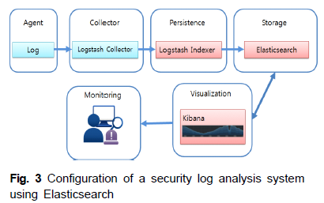

# 아파치 엘라스틱서치 기반 로그스태시를 이용한 보안로그 분석시스템

### 결과    
Elasticsearch 기반의 로그 분석시스템을 사용할 경우 하둡 기반의 로그 분석시스템에 비하여     
데이터베이스 쿼리 처리시간 및 로그 데이터 분석 시간을 현저하게 줄일 수 있음을 보임. 성능 개선

### 로그
사용자의 행동패턴 및 이벤트 등을 저장하는 대상

보안사고 혹은 시스템 장애 발생 시 중요한 증거장료로 사용될 뿐만 아니라,    
외부위협, 이상행위 등을 탐지하기 위한 용도로 사용됨

### 로그스태시
다양한 종류의 로그데이터를 입출력 및 가공 처리할 수 있는 엘라스틱서치의 수많은 플러그인 중 하나

오픈소스 서버측 데이터 처리 파이프라인으로서 다양한 소스에서 동시에 데이터를 수집하여 변환한 후    
자주 사용하는 저장소 즉, 엘라스틱 서치로 보냄    
데이터가 소스에서 저장소로 이동함에 따라 로그스태시 filter는 각 이벤트의 구문을 분석하고     
명명된 필드를 식별하여 구조를 구성, 공통 형식으로 변환 통합하여 분석을 쉽게 하고 시간을 단축시킴

## 엘라스틱서치를 이용한 보안로그 분석시스템 구현

### 엘라스틱서치를 이용한 보안로그 분석시스템의 전체구성도    
에이전트와 보안 디바이스에서 발생하는 보안 로그 데이터를 로그스태시 컬렉터를 이용하여    
수집 후 로그스태시 인덱서와 엘라스틱서치 싱크를 이용해 엘라스티서치에 저장하여 키바나를 이용하여   
시각화 및 사용자 모니터링을 할 수 있도록 구성    

먼저, 로그스태시 컬렉터는 에이전트 부분에 존재하는 방화벽, 웹서버 등의 보안 장비에서 나오는 로그데이터를 수집    

그 다음 로그스태시 인덱서에서 로그스태시 컬렉터로부터 로그 데이터를 수집한 후에 엘라스틱서치에 데이터를 저장    

이렇게 하면 분산검색엔진인 엘라스티서치를 이용해 로그 데이터를 인덱싱하여 필요한 때에 실시간으로 데이터를 분석하고 검증 가능

마지막으로 키바나를 이용하여 시각적으로 로그 통계 및 검색 리포트를 생성하고 그 결과를 시각화   

## 보안 로그 분석시스템 성능 비교 분석
